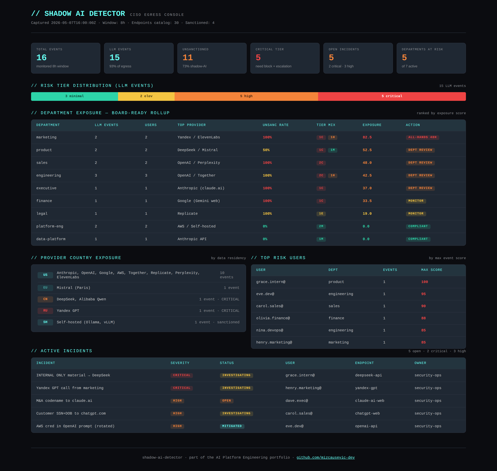

# Shadow AI Detector

[](https://github.com/mizcausevic-dev/shadow-ai-detector/actions/workflows/ci.yml)
[](https://nodejs.org)
[](https://www.typescriptlang.org)
[](LICENSE)

Detect unauthorized LLM usage across enterprise networks. Endpoint catalog, traffic pattern analysis, payload sensitivity scanning, department-level shadow-AI exposure rollups, and CISO-ready incident reporting.

> Recruiter takeaway:
>
> *"This person built the thing CISOs are asking the platform team to build right now — and it ships with a 30-endpoint catalog, payload PII/credential scanning, country-of-origin risk weighting, and department-level exposure scoring. CyberArk pedigree shows in every module."*

## Why This Exists

By 2026, every enterprise has a shadow-AI problem. Sales teams paste customer PII into chatgpt.com. Engineers paste production credentials into Together AI. Executives type M&A codenames into claude.ai. Marketing tries Yandex GPT for "free translation." Most companies have no detection layer at all — they just hope their DLP catches the symptoms.

This repo is the detection layer. It ingests proxy/firewall traffic, classifies each request against a catalog of 30+ known LLM endpoints (commercial APIs, inference hosts, consumer web interfaces, self-hosted patterns), scans payloads for credentials/PII/classified markers, applies country-of-origin and volume signals, and rolls everything up into department-level exposure scores that a CISO can take to a board meeting.

It's a CISO tool. Built by someone who's already worked enterprise security platforms.

## Where This Sits in the Portfolio

| Repo | Surface | Question it answers |
|---|---|---|
| [`mcp-sentinel`](https://github.com/mizcausevic-dev/mcp-sentinel) | Tool calls | What MCP tools are exposed and how risky? |
| [`rag-sentinel`](https://github.com/mizcausevic-dev/rag-sentinel) | Retrieval | What's in the vector store and how trustworthy? |
| [`agent-codex`](https://github.com/mizcausevic-dev/agent-codex) | Decisions | Under what policies are decisions allowed? |
| [`agent-eval-arena`](https://github.com/mizcausevic-dev/agent-eval-arena) | Pre-prod | Should this model promotion ship? |
| [`agentobserve`](https://github.com/mizcausevic-dev/agentobserve) | Runtime | What did agents actually do? |
| [`kinetic-flightdeck`](https://github.com/mizcausevic-dev/kinetic-flightdeck) | Operator | Are we OK right now? |
| **`shadow-ai-detector`** | **Egress** | ***Who's leaking what to whom — and from what dept?*** |

## What It Detects

### Endpoint Catalog (30+ providers)

| Tier | Examples |
|---|---|
| Frontier APIs | Anthropic, OpenAI (chat + DALL·E), Google GenAI/Vertex, Azure OpenAI, AWS Bedrock |
| Mainstream APIs | Cohere, Mistral, Voyage |
| Inference hosts | Together AI, Replicate, Fireworks, Groq, Hugging Face Inference |
| Image / voice | Stability AI, ElevenLabs |
| Consumer web (shadow-AI red flags) | chatgpt.com, claude.ai, gemini.google.com, perplexity.ai, character.ai |
| High-risk regions | DeepSeek (CN), Alibaba Qwen (CN), Moonshot Kimi (CN), Yandex (RU) |
| Self-hosted | Ollama, vLLM (private IP detection) |

Each endpoint carries default risk band, source country, capability classification, and notes.

### Payload Scanner — 21 patterns across 6 categories

| Category | Patterns | Example signals |
|---|---|---|
| `credential` | Private key blocks, AWS access keys, API key prefixes, JWTs, GitHub PATs, Slack tokens, inline passwords |
| `pii` | US SSN, IBAN, phone, email, DOB markers |
| `pci` | Credit card patterns, CVV markers |
| `health` | MRN markers, ICD codes |
| `internal-marker` | CONFIDENTIAL/SECRET/INTERNAL ONLY/RESTRICTED, M&A codename patterns |
| `source-code` | AWS SDK creds, database connection strings with embedded passwords |

Matches return redacted snippets — never raw secrets in the output.

### Risk Scorer — composite per event

```
score = endpoint_default_risk_band
      + sanction_penalty (sanctioned: 0, unsanctioned: +35, unknown: +25)
      + country_residency_penalty (CN/RU: +15)
      + payload_severity_sum (critical: +35 each, high: +20, medium: +10, low: +3)
      + volume_anomaly (>256KB upload: +10)
```

| Score | Tier | Recommended action |
|---|---|---|
| 0-24 | minimal | No action; normal sanctioned traffic |
| 25-49 | elevated | Log for weekly review |
| 50-74 | high | Quarantine session; require justification |
| 75-100 | critical | Block egress; alert CISO + manager; preserve for forensics |

### Department Rollup

For each department: total events, LLM events, unique users/providers, tier distribution, top provider, unsanctioned rate, and a composite `exposureScore` that weights criticals heavily and unsanctioned-rate proportionally. Recommended actions scale: weekly monitoring → dept-level review → all-hands briefing within 48h for hotspots.

## API Endpoints

| Method | Endpoint | Purpose |
|---|---|---|
| GET | `/health` | Service status |
| GET | `/api/endpoints` | Full LLM catalog + sanctioned list + provider metadata |
| POST | `/api/endpoints/classify` | Classify a single URL/host |
| POST | `/api/analyze/payload` | Scan a payload for sensitive content |
| POST | `/api/analyze/event` | Assess a single traffic event end-to-end |
| POST | `/api/analyze/traffic` | Bulk-assess events; return summary + per-dept rollup + per-event verdicts |
| GET | `/api/incidents` | List incidents (filter by `?status=` and `?severity=`) |
| GET | `/api/incidents/:id` | Single incident |
| GET | `/api/dashboard/summary` | CISO summary against the demo dataset |
| GET | `/api/dashboard/exposure` | Department exposure rankings |

## Sample: Single Event Assessment

```json
POST /api/analyze/event
{
  "event": {
    "eventId": "evt_001",
    "timestamp": "2026-05-07T11:02:30Z",
    "url": "https://api.deepseek.com/chat/completions",
    "method": "POST",
    "payloadSnippet": "Translate technical spec. INTERNAL ONLY material attached.",
    "user": "grace.intern@corp.com",
    "department": "product",
    "sourceHost": "10.7.40.56",
    "bytesUp": 32768,
    "bytesDown": 8192
  }
}
```

```json
{
  "eventId": "evt_001",
  "matched": true,
  "endpointId": "deepseek-api",
  "provider": "DeepSeek",
  "sanctionStatus": "unsanctioned",
  "riskScore": 100,
  "riskTier": "critical",
  "signals": [
    "Endpoint deepseek-api classified as high default risk.",
    "Endpoint not on org sanctioned list.",
    "Data residency / export-control concern.",
    "Provider hosted in CN; data residency / export-control concern.",
    "internal-marker pattern detected: classified-marker (critical).",
    "Payload contains content recommended for block."
  ],
  "recommendedAction": "Block egress; alert CISO + user manager; preserve traffic for forensics."
}
```

## Operator Console Preview



## Getting Started

### Prerequisites

- Node.js 20+
- npm

### Setup

```bash
git clone https://github.com/mizcausevic-dev/shadow-ai-detector.git
cd shadow-ai-detector
npm install
npm run dev
```

Visit:

- `http://localhost:3000/health`
- `http://localhost:3000/api/dashboard/summary`
- `http://localhost:3000/api/endpoints`

### Run Tests

```bash
npm test
```

36 unit tests across endpoint classification, payload scanning, risk scoring, and department rollup.

## What This Demonstrates

- Security-first thinking applied to AI infrastructure (CyberArk pedigree, applied)
- Pattern catalog work — non-trivial regex hardening, redacted snippet output, severity-aware aggregation
- Country-of-origin / sanctions awareness as first-class signal
- Department-level rollup that produces board-ready exposure metrics
- Strict-mode TypeScript with full test coverage; CI matrix on Node 20 + 22
- Heuristic-first detection — no LLM-as-judge in the hot path; deterministic, testable, cheap

## Future Enhancements

- Wire to actual proxy/firewall log streams (Zscaler, Netskope, syslog tail)
- ML-based anomaly detection layered on top of pattern catalog
- User-level baseline + drift detection (per-user normal usage profile)
- Integration with SIEM (Splunk, Datadog, Elastic) for incident enrichment
- Auto-block plumbing via firewall API
- DLP rule generator — emit Zscaler/Netskope policy from sanctioned list
- Quarterly board-ready PDF exposure report

## Tech Stack

- Node.js, TypeScript, Express, Zod
- Helmet, CORS, Morgan
- Node test runner

## Portfolio Links

- [LinkedIn](https://www.linkedin.com/in/mizcausevic/)
- [Skills Page](https://mizcausevic.com/skills)
- [Medium](https://medium.com/@mizcausevic)
- [GitHub](https://github.com/mizcausevic-dev)

Part of [mizcausevic-dev's GitHub portfolio](https://github.com/mizcausevic-dev) — AI Platform Engineering doctrine.
