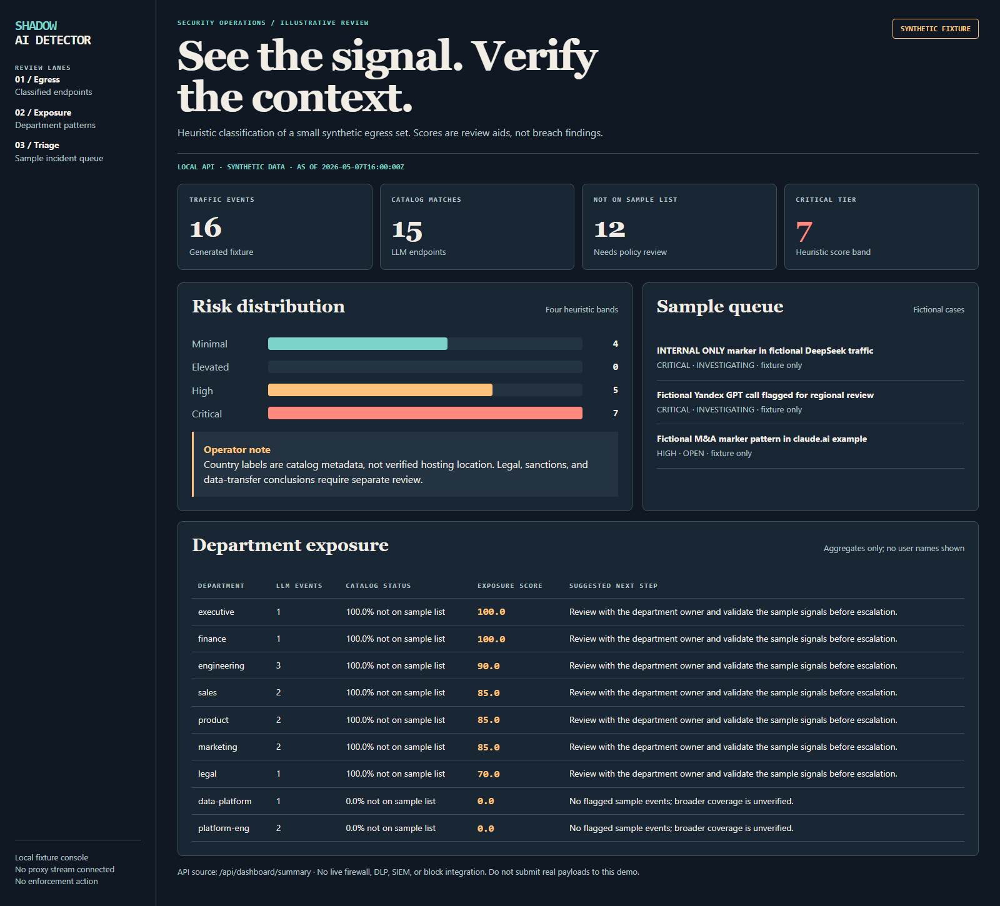

# Shadow AI Detector

[](https://github.com/mizcausevic-dev/shadow-ai-detector/actions/workflows/ci.yml)
[](https://nodejs.org)
[](https://www.typescriptlang.org)
[](LICENSE)

Local shadow-AI classification demonstrator with an endpoint catalog, payload pattern scanner, heuristic risk scoring, and synthetic department and incident fixtures.

> **Demo boundary:** No proxy, firewall, DLP, SIEM, identity, or enforcement integration exists. The traffic and incidents are fictional. Country labels are catalog metadata, not proof of hosting location, data residency, sanctions status, or legal exposure. Scores are review aids, not verified security findings. Do not submit real credentials or personal data to this demo.

## Why This Exists

An egress review needs to connect destination classification and payload indicators to a clear triage path. This repository models that logic against a fixed synthetic scenario.

The API accepts caller-supplied example traffic; it does not ingest a live stream. It classifies against a static catalog, scans supplied text for sensitivity patterns, and computes sample department rollups. Every output requires human validation before an incident or policy decision.

The local service binds to `127.0.0.1` and requires an explicit `NODE_ENV=development` or `test` plus `SHADOW_LOCAL_FIXTURE=1` to start. It rejects non-loopback socket peers, foreign Host/Origin values, and the `Forwarded`, `X-Forwarded-For`, `X-Forwarded-Host`, `X-Forwarded-Proto`, and `Via` headers. This is containment, not authentication: a same-host proxy that rewrites headers can still expose it. Do not put it behind a proxy or tunnel or submit real data.

An injectable feed authorization path now exercises signed, short-lived access-token verification and server-owned resource ownership and client grants in tests. The normal service does not configure that path: `/api/feed/:resourceId/analyze/payload`, `/event`, and `/traffic` return 404. An injected test app serves those paths only after a shared, process-local burst quota and checks for an Ed25519 signature, exact issuer and audience, token type, age, expiry, scope, active-token status, resource tenant, and a grant for the signed `client_id` and exact resource. In that test app, the public fixture and `/api/analyze` routes are absent. No identity provider, revocation store, tenant registry, grant store, live feed, or production listener is configured. A future issuer must provide trustworthy `client_id` semantics before this can be integrated. The local quota is not a production ingress or distributed limit. See [the feed auth plan](docs/FEED_AUTH_PLAN.md) and [remaining evidence](docs/PRODUCTION_EVIDENCE.md).

## Where This Sits in the Portfolio

| Repo | Surface | Question it answers |
|---|---|---|
| [`mcp-sentinel`](https://github.com/mizcausevic-dev/mcp-sentinel) | Tool calls | What MCP tools are exposed and how risky? |
| [`rag-sentinel`](https://github.com/mizcausevic-dev/rag-sentinel) | Retrieval | What's in the vector store and how trustworthy? |
| [`agent-codex`](https://github.com/mizcausevic-dev/agent-codex) | Decisions | Under what policies are decisions allowed? |
| [`agent-eval-arena`](https://github.com/mizcausevic-dev/agent-eval-arena) | Pre-prod | Should this model promotion ship? |
| [`agentobserve`](https://github.com/mizcausevic-dev/agentobserve) | Runtime | What did agents actually do? |
| [`kinetic-flightdeck`](https://github.com/mizcausevic-dev/kinetic-flightdeck) | Operator | Are we OK right now? |
| **`shadow-ai-detector`** | **Egress** | ***Which sample destinations and patterns warrant review?*** |

## What It Detects

### Endpoint Catalog (29 patterns)

| Tier | Examples |
|---|---|
| Frontier APIs | Anthropic, OpenAI (chat + DALL·E), Google GenAI/Vertex, Azure OpenAI, AWS Bedrock |
| Mainstream APIs | Cohere, Mistral, Voyage |
| Inference hosts | Together AI, Replicate, Fireworks, Groq, Hugging Face Inference |
| Image / voice | Stability AI, ElevenLabs |
| Consumer web (shadow-AI red flags) | chatgpt.com, claude.ai, gemini.google.com, perplexity.ai, character.ai |
| Regional review examples | DeepSeek (catalog CN), Alibaba Qwen (catalog CN), Moonshot Kimi (catalog CN), Yandex (catalog RU) |
| Self-hosted | Ollama, vLLM (private IP detection) |

Each endpoint carries default risk band, source country, capability classification, and notes.

### Payload Scanner — 20 patterns across 6 categories

| Category | Patterns | Example signals |
|---|---|---|
| `credential` | Private key blocks, AWS access keys, API key prefixes, JWTs, GitHub PATs, Slack tokens, inline passwords |
| `pii` | US SSN, IBAN, phone, email, DOB markers |
| `pci` | Luhn-valid 16-digit card-like patterns, CVV markers |
| `health` | MRN markers, explicitly labeled ICD-10 codes |
| `internal-marker` | CONFIDENTIAL/SECRET/INTERNAL ONLY/RESTRICTED, M&A codename patterns |
| `source-code` | AWS SDK creds, database connection strings with embedded passwords |

Matches return a fixed `[redacted]` marker and pattern metadata, never a portion of the matched content. Luhn and ICD-10 label checks reduce two known false positives, but neither proves a true payment or medical finding. The request body is processed in memory by this local demo and is not intentionally logged or stored; production handling would need a reviewed retention and access design.

### Risk Scorer — composite per event

```
score = endpoint_default_risk_band
      + sanction_penalty (sanctioned: 0, unsanctioned: +35, unknown: +25)
      + catalog_country_review_weight (CN/RU: +15; not a residency conclusion)
      + payload_severity_sum (critical: +35 each, high: +20, medium: +10, low: +3)
      + volume_anomaly (>256KB upload: +10)
```

| Score | Tier | Recommended action |
|---|---|---|
| 0-24 | minimal | No pattern flagged in this sample |
| 25-49 | elevated | Review against local policy |
| 50-74 | high | Human review of a possible quarantine |
| 75-100 | critical | Human review of a possible block and escalation |

### Department Rollup

For each fictional department: total events, LLM events, unique users/providers, tier distribution, top provider, allowlist status, and a composite `exposureScore` that weights critical tiers and out-of-list destinations. Suggested next steps are review prompts, not validated escalation decisions.

## API Endpoints

| Method | Endpoint | Purpose |
|---|---|---|
| GET | `/health` | Service status |
| GET | `/api/endpoints` | Illustrative LLM catalog + fictional sample allowlist + provider metadata |
| POST | `/api/endpoints/classify` | Classify a single URL/host |
| POST | `/api/analyze/payload` | Scan a payload for sensitive content |
| POST | `/api/analyze/event` | Assess a single traffic event end-to-end |
| POST | `/api/analyze/traffic` | Bulk-assess events; return summary + per-dept rollup + per-event verdicts |
| GET | `/api/incidents` | List incidents (filter by `?status=` and `?severity=`) |
| GET | `/api/incidents/:id` | Single incident |
| GET | `/api/dashboard/summary` | Summary of the synthetic demo dataset |
| GET | `/api/dashboard/exposure` | Department exposure rankings |

The analysis endpoints label caller inputs `caller-supplied-unverified`, omit supplied event, user, host, and payload IDs from responses, and set `Cache-Control: no-store`. Bulk results use input position for correlation and replace department names with request-local labels such as `Department 1`; the labels are not stable across requests. Validation errors do not repeat supplied values. The bundled dashboard and incident endpoints remain labeled as synthetic fixtures. This response redaction does not provide authentication, tenant isolation, or safe handling for real employee or secret data; do not submit such data to the demo.

## Sample: Single Event Assessment

```json
POST /api/analyze/event
{
  "event": {
    "eventId": "evt_001",
    "timestamp": "2026-05-07T11:02:30Z",
    "url": "https://api.deepseek.com/chat/completions",
    "method": "POST",
    "payloadSnippet": "Translate technical spec. INTERNAL ONLY material attached.",
    "user": "grace.intern@corp.com",
    "department": "product",
    "sourceHost": "10.7.40.56",
    "bytesUp": 32768,
    "bytesDown": 8192
  }
}
```

```json
{
  "dataMode": "caller-supplied-unverified",
  "identifierHandling": "caller-identifiers-omitted",
  "inputIndex": 0,
  "matched": true,
  "endpointId": "deepseek-api",
  "provider": "DeepSeek",
  "sanctionStatus": "unsanctioned",
  "riskScore": 100,
  "riskTier": "critical",
  "signals": [
    "Endpoint deepseek-api classified as high default risk.",
    "Endpoint not on the sample allowlist.",
    "Illustrative regional review flag; hosting location requires verification.",
    "Catalog country is CN; verify actual processing location and applicable transfer rules.",
    "internal-marker pattern detected: classified-marker (critical).",
    "Payload contains a pattern requiring human review before any block decision."
  ],
  "recommendedAction": "Review for possible egress block and escalation; validate the finding and retention basis first."
}
```

## Operator Console Preview



This is a Chrome capture of `/preview` against the running local API. The page fetches `/api/dashboard/summary` and `/api/incidents`; it does not show a live enterprise network. After setting the local fixture environment variables below, recreate it with `npm.cmd run build`, `npm.cmd start`, then open `http://127.0.0.1:3000/preview`.

## Getting Started

### Prerequisites

- Node.js 20.19+ or 22.12+ (Node 24+ is also supported by the declared engine range)
- npm

### Setup

```powershell
git clone https://github.com/mizcausevic-dev/shadow-ai-detector.git
Set-Location shadow-ai-detector
npm.cmd ci
$env:NODE_ENV = 'development'
$env:SHADOW_LOCAL_FIXTURE = '1'
npm.cmd run dev
```

On macOS or Linux, use `NODE_ENV=development SHADOW_LOCAL_FIXTURE=1 npm run dev`. The opt-in enables only the local synthetic fixture; it is not a credential or permission grant. Missing or unsupported mode, missing opt-in, or an invalid `PORT` refuses startup.

Visit:

- `http://localhost:3000/health`
- `http://localhost:3000/api/dashboard/summary`
- `http://localhost:3000/api/endpoints`
- `http://127.0.0.1:3000/preview`

### Run Tests

```bash
npm test
```

The suite covers endpoint classification, payload scanning, risk scoring, department rollups, API privacy boundaries, input caps, and the preview route. A separate hand-labeled synthetic challenge set has 13 endpoint cases and 17 payload cases, including near misses. Passing it guards against these regressions; it does not estimate field precision, recall, or a false-positive rate. Real accuracy validation requires permissioned, representative traffic and human-labeled outcomes.

## What This Demonstrates

- Deterministic endpoint and payload-pattern triage for a synthetic egress sample
- Pattern catalog work — non-trivial regex hardening, redacted snippet output, severity-aware aggregation
- Configurable policy and region-review concepts without asserting sanctions or data-residency conclusions
- Department-level rollup that demonstrates a possible review format; not a board-ready finding
- Heuristic detection with no model-based judge or live enforcement in the request path
- Strict-mode TypeScript with CI on Node 20 + 22

## Production gates

Before any deployment beyond loopback: configure and verify the issuer, pinned public keys, active-token/revocation check, server-owned resource registry, and caller-to-resource grants against a private target; add a permissioned ingestion contract, a server-owned sanctioned list, approved endpoint and region metadata, trusted-ingress and distributed rate limits, privacy review for payload and user identifiers, retention/deletion controls, secure logging, and validated incident workflow. This repository does not block egress or create real incidents.

The evidence needed to evaluate those gates is listed in [docs/PRODUCTION_EVIDENCE.md](docs/PRODUCTION_EVIDENCE.md). The [local release plan](docs/LOCAL_RELEASE_PLAN.md) records the synthetic-only rollback rehearsal; it does not prove a production rollback.

## Future Enhancements

- Wire to actual proxy/firewall log streams (Zscaler, Netskope, syslog tail)
- ML-based anomaly detection layered on top of pattern catalog
- User-level baseline + drift detection (per-user normal usage profile)
- Integration with SIEM (Splunk, Datadog, Elastic) for incident enrichment
- Auto-block plumbing via firewall API
- DLP rule generator — emit Zscaler/Netskope policy from sanctioned list
- Quarterly board-ready PDF exposure report

## Tech Stack

- Node.js, TypeScript, Express, Zod
- Helmet
- Node test runner

## Portfolio Links

- [LinkedIn](https://www.linkedin.com/in/mizcausevic/)
- [Skills Page](https://mizcausevic.com/skills)
- [Medium](https://medium.com/@mizcausevic)
- [GitHub](https://github.com/mizcausevic-dev)

Part of [mizcausevic-dev's GitHub portfolio](https://github.com/mizcausevic-dev) — AI Platform Engineering doctrine.

---

**Connect:** [LinkedIn](https://www.linkedin.com/in/mirzacausevic/) · [Kinetic Gain](https://kineticgain.com) · [Medium](https://medium.com/@mizcausevic/) · [Skills](https://mizcausevic.com/skills/)
